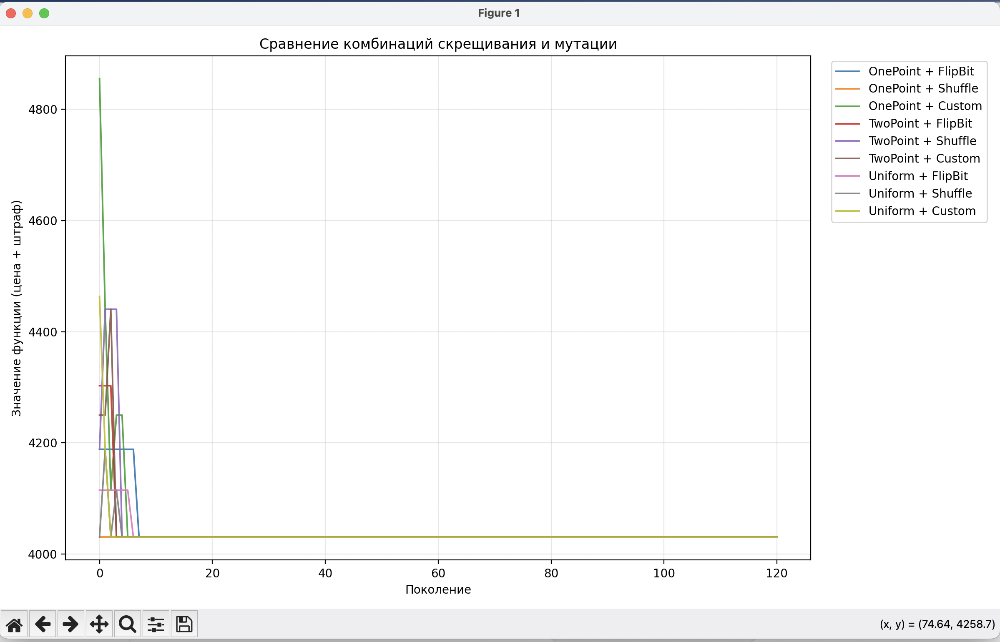
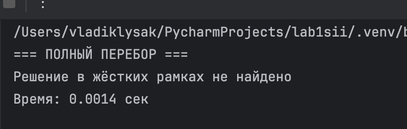

# Лабораторная работа 1. Гинетические алгоритмы
## Общее задание

1. Необходимо разработать программу на языке python, реализующую генетический алгоритм по предложенному вариантом заданию.
2. Провести эксперименты по разным способам скрещивания (не менее 3-х), разным способам мутирования (не менее трех). Результат отобразить в виде графиков
3. Моделирование данных производить на основе максимально правдоподобных данных. Т.е. если рассматривается задача, в которой есть калорийность продуктов, то должны использоваться данные о реальных продуктах с реальной калорийностью.
4. Предоставить отчет о проделанной работе.
## Вариант 6
На языке Python разработайте скрипт, который с помощью генетического алгоритма и полного перебора решает следующую задачу. Дано N наименований продуктов, для каждого из которых известно m характеристик. Необходимо получить самый дешевый рацион из k наименований, удовлетворяющий заданным медицинским нормам для каждой из m характеристик.

## Загрузка необходимых библиотек
```
import random
import itertools
import time
import numpy as np
import matplotlib.pyplot as plt
from deap import base, creator, tools, algorithms
from functools import partial
```
## Необходимые данные 
```
products = [
    ("Куриная грудка", 250, 165, 31, 3.6, 0),
    ("Говядина",       400, 250, 26, 15,  0),
    ("Рис",             80, 360,  7, 0.6, 78),
    ("Гречка",          90, 343, 13, 3.4, 72),
    ("Молоко",          70,  42, 3.4, 1,   5),
    ("Яйца",           120, 155, 13, 11,   1.1),
    ("Яблоко",          60,  52, 0.3, 0.2, 14),
    ("Банан",           65,  96, 1.3, 0.3, 27),
    ("Сыр",            500, 402, 25, 33,   1.3),
    ("Йогурт",          90,  59, 10, 0.4,  3.6),
    ("Картофель",       50,  77,  2, 0.1, 17),
    ("Лосось",         600, 208, 20, 13,   0),
]

N = len(products)
K = 5 

NORMS = {
    "kcal":   (2000, 2500),
    "protein": (75,  150),
    "fat":    (50,  100),
    "carbs":  (250, 400)
}
```
Указываем усредненные данные и медицинские нормы

## Полный перебор
```
def brute_force():
    best_cost = float("inf")
    best_combo = None
    for combo in itertools.combinations(range(N), K):
        cost = sum(products[i][1] for i in combo)
        kcal   = sum(products[i][2] for i in combo)
        prot   = sum(products[i][3] for i in combo)
        fat    = sum(products[i][4] for i in combo)
        carbs  = sum(products[i][5] for i in combo)

        if (NORMS["kcal"][0]   <= kcal   <= NORMS["kcal"][1]   and
            NORMS["protein"][0] <= prot   <= NORMS["protein"][1] and
            NORMS["fat"][0]     <= fat    <= NORMS["fat"][1]     and
            NORMS["carbs"][0]   <= carbs  <= NORMS["carbs"][1]):
            if cost < best_cost:
                best_cost = cost
                best_combo = combo
    return best_cost, best_combo
```
Полный перебор - это метод который гарантированно находит глобальный оптимум.

Глобальный перебор - это допустимое решение задачи которое наилучшее среди всех решений задачи.

## Функция Оценки
```
def evaluate(individual):
    cost = kcal = prot = fat = carbs = 0
    selected_count = sum(individual)

    for i, selected in enumerate(individual):
        if selected:
            p = products[i]
            cost  += p[1]
            kcal  += p[2]
            prot  += p[3]
            fat   += p[4]
            carbs += p[5]

    penalty = 0

    # Штраф за количество продуктов (самый строгий)
    if selected_count != K:
        penalty += 20000 * abs(selected_count - K)
        
        # Штрафы за выход за диапазон
    for value, (low, high), w in [
        (kcal,   NORMS["kcal"],   5),
        (prot,   NORMS["protein"], 8),
        (fat,    NORMS["fat"],    6),
        (carbs,  NORMS["carbs"],  4)
    ]:
        if value < low:
            penalty += (low - value) * w
        elif value > high:
            penalty += (value - high) * w

    return cost + penalty,
```
Функция оценки - это функция которая показывает степень присосбленности индивида в популяции.
Она позволяет определить, насколько хорошо решение соответствует цели оптимизации и выбрать наиболее подходящий.

Задача условной оптимизации преобразована в безусловную путём добавления штрафов за нарушение ограничений. Такой подход позволяет применять стандартный генетический алгоритм без явной обработки ограничений.

Так же необходимо чтобы штрафы были высокие, иначе алгоритм будет предпочитать дешевые, но недопустимые решения. Например если средняя стоимость 3000 - 5000, то штраф необходим 20000 и более.

В данном коде я использую линейный штраф. Линейный штраф - это метод учета ограничений через добавление к целевой функции слагаемого, пропорционального величине нарушения ограничения. 

Плюсы: Хорошо работает когда нарушение небольшое. 


Минусы: При больших нарушениях может доминировать над целевой функцией, а так же приходится подбирать коэффициенты штрафа вручную.

### Создание особи:
```
def create_individual():
    ind = [0] * N
    indices = random.sample(range(N), K)
    for i in indices:
        ind[i] = 1
    return ind
```
Структура хромосомы - бинарный вектор фиксированной длины N

Мы создаем особь для того, чтобы выьрать ровно K предметов. Каждая особь изначально создается уже удовлетворяющей ограничению нашей задачи.

Она необходимо для того, чтобы пологаться не только на штраф. Благодаря ей уменьшается доля невалидных решений в начальной популяции.

## Кастомная мутация
```
def custom_mutation(individual):
    ones  = [i for i, g in enumerate(individual) if g == 1]
    zeros = [i for i, g in enumerate(individual) if g == 0]
    if ones and zeros:
        i = random.choice(ones)
        j = random.choice(zeros)
        individual[i] = 0
        individual[j] = 1
    return individual,
```
В данном шаге мы используем специализированную мутацию с сохранением колличеством единиц.
Случайно выбираем один выбранный элемент и один не выбранный, после чего они меняются местами.

Данный оператор гарантированно сохраняет ограничение, благодаря чему ускоряет сходимость алгоритма и повышает качество получаемых решений по сравнению с побитовым мутациями.

### ИНИЦИАЛИЗАЦИЯ DEAP:
```
creator.create("FitnessMin", base.Fitness, weights=(-1.0,))
creator.create("Individual", list, fitness=creator.FitnessMin)

toolbox = base.Toolbox()

toolbox.register("individual", tools.initIterate, creator.Individual, create_individual)
toolbox.register("population", tools.initRepeat, list, toolbox.individual)

toolbox.register("evaluate", evaluate)
toolbox.register("select",   tools.selTournament, tournsize=3)

toolbox.register("mate",   tools.cxTwoPoint)           # будет переопределяться
toolbox.register("mutate", tools.mutFlipBit, indpb=0.08)
```


## ЗАПУСК АЛГОРИТМА
```
def run_ga(cx_operator, mut_operator, cxpb=0.75, mutpb=0.25, ngen=120, popsize=180):
    toolbox.register("mate",   cx_operator)
    toolbox.register("mutate", mut_operator)

    pop = toolbox.population(n=popsize)
    hof = tools.HallOfFame(1)

    stats = tools.Statistics(lambda ind: ind.fitness.values[0])
    stats.register("min", np.min)

    pop, logbook = algorithms.eaSimple(
        pop, toolbox,
        cxpb=cxpb, mutpb=mutpb,
        ngen=ngen,
        stats=stats,
        halloffame=hof,
        verbose=False
    )

    return logbook.select("min"), hof[0]
```
Функция run_ga выполняет один полный запуск генетического алгоритма с заданными вероятностями и операторами, используя стандартный метод eaSimple из DEAP, и возвращает историю лучших приспособленностей и лучшую найденную особь

## Операторы мутации
Кроссовер - ператор, который создаёт двух потомков, комбинируя генетический материал двух родителей.

Я сравниваю 3 вида:

OnePoint - одноточечное: выбирается одна точка разрыва, левая часть от одного родителя, правая — от другого

TwoPoint — двухточечное: две точки разрыва  три сегмента, средний меняется местами

Uniform — равномерное: для каждого гена случайно выбирается, от какого родителя его взять

Мутация - ператор, который вносит небольшие случайные изменения в хромосому потомка.

FlipBit - побитовая мутация для бинарных хромосом.

Shuffle - Перемешивание (shuffle) индексов/генов.

Custom - Специально написанная под задачу мутация.

## ВЫВОД РЕЗУЛЬТАТОВ ОСОБИ
Генетический алгоритм демонстрирует быструю сходимость (менее 10 поколений), что обусловлено малой размерностью задачи и ограниченным пространством решений. 

Все исследованные комбинации операторов приводят к одному и тому же значению целевой функции, что свидетельствует о нахождении глобального оптимума. 

Различия наблюдаются только на начальной стадии эволюции.



## ВЫВОД РЕЗУЛЬТАТОВ ОСОБИ
Метод полного перебора показал, что при заданных жёстких ограничениях допустимого решения в строгой постановке задачи не существует, что свидетельствует о противоречивости или чрезмерной строгости введённых нормативов при выбранном количестве продуктов. Вместе с тем применение генетического алгоритма с использованием штрафной функции позволило получить квазиоптимальное решение, минимизирующее суммарную стоимость с учётом штрафов за нарушение ограничений.

